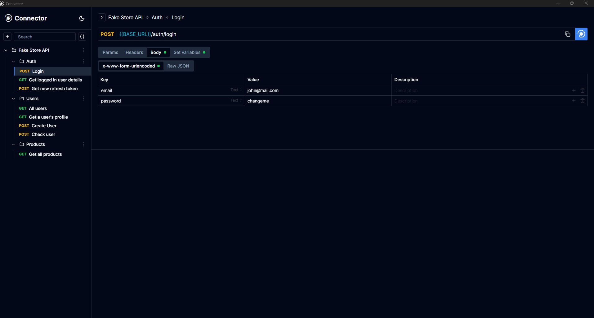
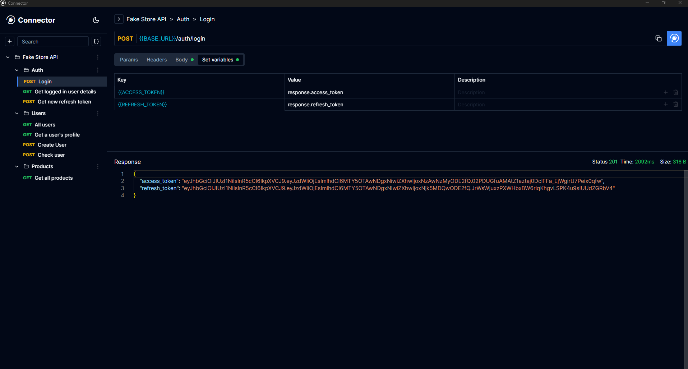

   

<h1 style="text-align:center">
    Connector
</h1>

Connector represents a groundbreaking advancement in the realm of web and desktop applications, providing an intuitive and efficient platform for handling API calls and constructing APIs with remarkable simplicity. This innovative solution is uniquely designed to streamline the process of API development and management.

At its core, Connector is a lightweight yet powerful tool that significantly outperforms existing applications in terms of efficiency and ease of use. Its user-friendly interface empowers users to effortlessly create collections, add APIs, and configure a range of parameters, including query parameters, path variables, and headers.

